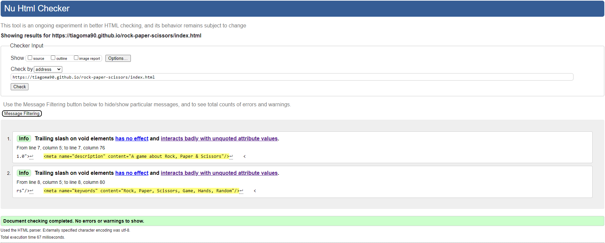

## Rock - Paper - Scissors
The 'Rock - Paper - Scissors' game is an interactive webpage, where users gets to play against the computer the iconic hand game that everybody played since childhood.

Visitors of this website will be able to play against the computer, where the one in question, throws random hands based in a raffle algorithm.
The website is targeted to people looking for a quick game.

# Live Project
The live website can be found [here](https://tiagoma90.github.io/rock-paper-scissors/).

## Process
# HTML & Skeleton
ELABORTAE: The website was designed and structured with divs grouped and organized both vertically and horizontally in the center of the page.
INSERT SCREENSHOTS OF THE WEBSTE

The body has a main div that collects all elements, with the exception of the footer, to keep it below the main content.
Inside the main the we find h2, divs, displaing the profile images for the hands, p followed by the scoreboard, random comments by the computer, the buttons and finally a reset button for the overall score.
The structure of the page can be more or less defined and follows the skeleton for the overall website as seen below:

The Fonts used for the Title and paragraphs was Wallpoet which gives a cool and stylish look to the overall text components of the game.

# CSS & Styling
- The color palette chosen for this website, makes use of dark colors, such as black and gray for the background.
- Plain white and faded Gray for text and a vibrant red for the solid borders.
- The cursor is transformed into a pointer, upon hovering the interactive buttons and the buttona zoom in and out, according to user interactivity.
- The buttons and protrait frames display a round radius, and shadow outside the border.

# JavaScript & Logic
The game follows the basic rules of Rock, Paper, Scissors, where one beats one another or draws against each other.
For each round, the User or Com(puter) deals their hands by clicking the buttons: Rock, Paper or Scissors.
Based on the outcome, the score will therefore be either incremented by one (+1), or drawn by zero (0)
The game also offers the the possibility to reset the score by zero, by clicking the Reset Button.

Elaborate:
-The hands, defined by the buttons class "press" make use of the addEventListener("click") that targets the Id.

- comAI()
This function works as the core brain for the Computer.
It´s hands are justified by the .lenght the of the possibleHands dealt by the User.
Conected to the hands are numbers 1, 2, 3 that correspond to the assigned hands, attributed to comLogs, by strict equality.
Inside this function, are the functions rockComDisplay, paperComDisplay and scissorsComDisplay.
This function makes use of the methods:
Math.ceil to round up the integer, and reject decimals.
Math.random to raffle the random numbers, times the .length (or in this case, *3)

- resultsByHand()
The Rules of the game were defined by if/else if/else statements between User and Com, on trms of strict equality.
Ergo, IF both parties have the same hands, the result falls to a Draw.
ELSE IF the User has the Upperhand in all of the events, the User wins and the score is incrememted by one (+1), under the function userPointsIncrement()
If all ELSE the statenets above are false, the User loses and therefore the Com score is incremmented by one (+1), under the functions comPointsIncrement()
Inside this function, for each statemet, are other functions to make the game a bit more intriguing. As if the Com narrating/speaking to the user under rockText(), paperText() and scissorsText().

- function user/comWins()
This function incremnets the score by one(+1), that would later be called inside of the if/else if/else statements.

- reset()
This function resets the game score back to zero (0) and the profile pictures are set back to default.
To achieve this, the innerText equals 0. Respectively, inside this function are two other functions entitled resetUserDisplay() and resetComDisplay() that manimpulates the defaults pictures back to normal.

- rock/paper/scissorsText()
These functions contain an Array of indexed "strings" that return a random number, issued by the same syntax used in comAI. Therefore, Math.floor (this time) and Math.random

- rock/paper/scissorsUserDisplay() and rock/paper/scissorsComDisplay()
These functions manipulate the DOM, by grabbing given elements and attributing new images to the same elements. They are called by the butoon, with the onclick attribute.

- startGame()
Function that is executed by the onclick event, called inside the .html and is executed once the Webpage is open, but removed by the .remove method.

## Assay
# Testing

ELABORATE
# Validation

All .html and .css pages of this website were validated through [validator.w3.org](https://validator.w3.org/#validate_by_input) & [jigsaw.w3.org](https://jigsaw.w3.org/css-validator/validator) and found no errors or warnings whatsoever, both via URL and Direct Input.

HTML code passed through the official W3C validator with no issues.
See following links:
- [index.html](https://validator.w3.org/nu/?doc=https%3A%2F%2Ftiagoma90.github.io%2Frock-paper-scissors%2Findex.html)

CSS code passed through the official (Jigsaw) validator with no issues
- [style.css](https://jigsaw.w3.org/css-validator/validator?uri=https%3A%2F%2Ftiagoma90.github.io%2Frock-paper-scissors%2Findex.html&profile=css3svg&usermedium=all&warning=1&vextwarning=&lang=de)

    

    

#DevTools & Lighthouse

The webpage for this game, under Ingognito mode, was scanned for Performance, Accessibility, Best Practices and SEO for both Desktop and Mobile devices under the Lighthouse function provided by Chrome DevTools, with favorable scores.

# Desktop & Mobile

## Technologies
# Languages
The website was written under HTML5 and CSS3.
- HTML5 - Structure of the page
- CSS3 - Style of the page
- JSES6 - Logic and interactivity of the page

Other forms of development as follows:
- Tiny PNG - Image compresser
- Convertio - Image converter
- Google Fonts - Source of fonts
- Github - Host for the repository
- Gitpod - Code editor
- Chrome DevTools - Testing tool
- WAVE Evaluation tool - Testing tool

## Development & Deployment
The project was developed using GitHub and GitPod platforms.

- Navigate to: "Repositories" and create "New".
- Mark the following fields: ✓ Public ✓ Add a README file.
- Select template: "Code-Institute-Org/gitpod-full-template".
- Add a Repository name: "rock-paper-scissors".
- And create Repository.

This project was developed using GitPod and suffered various executions using the inbuild Terminal.
- git add . - Command used before commiting.
- git commit -m "written imperative declaration" - Command used to declare changes and updates.
- git push - Command used to push all updates to the GitHub Repository and live version.
- python -m http.server 8000 - Command used to load the website on port 8000.

The website was deployed via Github
Under the given Repository, navigate to "Settings".
Navigate to "Pages" from the left-hand bar.
From here the "Source" should be set to "Deploy from branch"
On "Branch" select "main" and save.
The website was deployed via Github and the live version can be found here

Credits
Content:
ELABORATE
