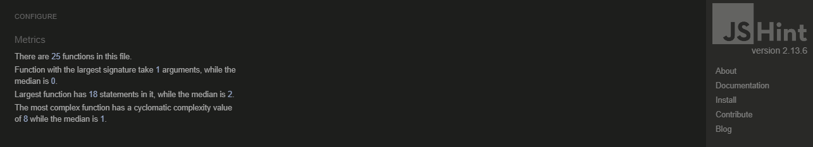
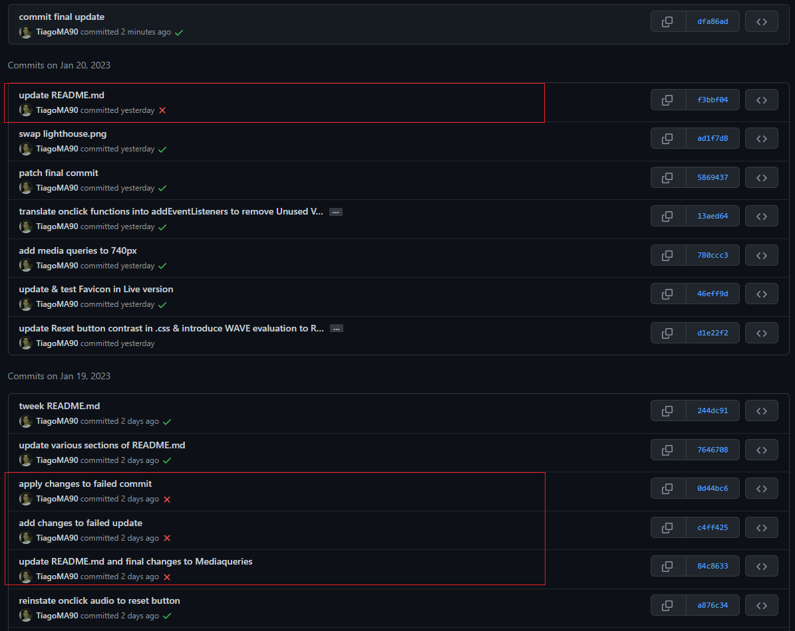

# Rock - Paper - Scissors
The 'Rock - Paper - Scissors' game is an interactive webpage, where users get to play against the computer the iconic hand game that everybody played as a child.
Visitors of this website will be able to play against the COM, where the one in question throws random hands based in a raffle algorithm.

The website is targeted to people looking for a quick fun game.

# Development Process
## HTML & Skeleton
The website was designed and structured with divs grouped and organized both vertically and horizontally in the center of the page.

The body has a main div that collects all elements, with the exception of the footer<> at the very bottom of the page, to keep it below the main content.
Inside the main<> we find the following Tags: h2<> displaying a Title, followed by img<> flaunting the Profile Images and chosen Hands, p<> with a Scoreboard and random Text radomly sorted by the COM, the buttons<> that give the User the possibility to click and engage in battle against the COM and finally the Reset button, that allows the user to reset the Score.
The structure of the page can be more or less mapped as seen below:

## Features
The website was developed with the intent to offer interactive features such as images, buttons, sounds and overall working functionalities.

Modal
- The Webpage upon loaded, displays a Modal with instructions for the User, on how to play the game. The User is requested to click the button "Let's Play!" in order to procceed.

Button ("Let's Pay!)
- Once the User has clicked the button, the Modal is removed and the User can start playing.

Index
- The Index page offers the user Buttons and text that reacts according to a choice.

Buttons ("Rock", "Paper", "Scissors")
- A selection of buttons left for the User to choose from. Each button has a positive and negative response against the COM.

Button ("Reset")
- A single Button to let the User reset the game back to zero.

Images
- The usage of imagery makes it easy for the User to identify gaming functionalities, respective portraits (User and Computer) and Hands (Rock, Paper, Scissors).

Sound effects
- Sound effects are triggered once a User clicks a certain hand. This makes the interactivity rather appealing.

Text
- Upon drawing hands between the USER & COM, random text messages are displayed as narrated by the COM, giving a more enjoyable experience to the User.

Score
- The Score let's the User know the count between USER and COM. It is infinite and can be Reset anytime.

Favicon
- The website displays a favicon on it's respective tab. This favours the user to identify the webpage among all open tabs.

Footer
- This section of the page let's the user visit the Developers GitHub page.

## Wireframes

## CSS & Styling
- The color palette chosen for this website, makes use of dark colors, such as black and gray for the background.
- Plain white and faded Gray were chosen for the text and a vibrant red for the solid borders.
- The buttons and protrait frames display a round radius, and shadow outside the border.
- The cursor is transformed into a pointer upon hovering over buttons, further, they zoom in and out.
- The Fonts used for the Title and paragraphs was ['Wallpoet'](https://fonts.google.com/?query=wallpoet) which gives a cool and stylish look to the overall text components of the game.
- The profile pictures indicates who is the USER and who is the COM.

## JS & Logic
The game follows the basic rules of Rock, Paper, Scissors, where one beats one another or draws against each other.
For each round, the User or Com(puter) deals their hands by clicking the buttons: Rock, Paper or Scissors.
Based on the outcome, the score will be either incremented by one (+1), or drawn by zero (0).
The game also offers the possibility to reset the score by zero, by clicking the Reset Button.

- The hands functionality is defined by the buttons class ".press" that make use of the addEventListener("click") that targets the Id of the hands in the DOM
This event acts as a switch for the core functionality of the game. It calls both the functions comAI() and resultsByHand(), in parallel to the Users click.
The outcome for the COM and Result should be defined by both functions.

- comAI()
This function works as the core brain for the Computer.
Its hands are justified by the .lenght the of the possibleHands dealt by the User.
Connected to the hands are numbers 1, 2, 3 that correspond to the assigned hands, attributed to comLogs, by strict equality (===).
Inside this function, are the functions rockComDisplay(), paperComDisplay() and scissorsComDisplay().
This function makes use of the methods:
Math.ceil to round up the integer, and reject decimals.
Math.random is used to raffle the random numbers, times the .length (or in this case, *3)

- resultsByHand()
The Rules of the game are defined by if/else if/else statements between USER and COM, on terms of strict equality (===).
Ergo, IF both parties have the same hands, the result should fall to a Draw.
ELSE IF the USER has the Upperhand in all of the events, the USER wins and the score is incrememted by one (+1), under the function userPointsIncrement()
If all ELSE, the statements above are false, the USER loses and therefore the COM score is incremmented by one (+1), under the functions comPointsIncrement()
Inside this function, for each statemet, are other functions to make the game a bit more intriguing. The COM narrates to the user under rockText(), paperText() and scissorsText().

- function user/comWins()
This function incremnets the score by one(+1), that is later called inside the if/else if/else statements.

- reset()
This eventListener resets the game score back to zero (0) and the profile pictures are set back to default.
To achieve this, the innerText equals 0. Respectively, inside this function are two other functions entitled resetUserDisplay() and resetComDisplay() that manimpulates the default pictures back to normal.

- rock/paper/scissorsText()
These functions contain an Array of indexed "strings" that return a random number, issued by Math.floor and Math.random.

- rock/paper/scissorsUserDisplay() and rock/paper/scissorsComDisplay()
These functions manipulate the DOMs imagery, by grabbing the given elements and attributing new images to the same elements. They are called by the button, with the Click event set by Event listeners defined as rock, paper and scissors.

- startGame()
Function that is executed by the addEventListener, called by the Click event and dispatched once the Webpage is open, but later removed by the .remove method once clicked.

# Assay
## Testing
Manual testing was done by exploring the functionalities of the game.
After evident tests, all buttons act accordingly to their assigned functionalities.

- The "Let's Play!" button in the Modal unlocks the game and plays the buttonsfx.mp3.

- The "Rock" button, in the game, upon clicked draws the rockhand.webp and plays the rocksfx.mp3. If the COM draws Scissors, the USER wins and the results is incremented by 1. If the COM draws Rock, it's a tie and the resuts remains the same. If the COM draws Paper, the USER loses and the score for the COM is incremented by 1.

- The "Paper" button, in the game, upon clicked draws the paperhand.webp and plays the papersfx.mp3. If the COM draws Rock, the USER wins and the results is incremented by 1. If the COM draws Paper, it's a tie and the resuts remains the same. If the COM draws Scissors, the USER loses and the score for the COM is incremented by 1.

- The "Scissors" button, in the game, upon clicked draws the scissorshand.webp and plays the scissorssfx.mp3. If the COM draws Paper, the USER wins and the results is incremented by 1. If the COM draws Scissors, it's a tie and the resuts remains the same. If the COM draws Rock, the USER loses and the score for the COM is incremented by 1.

- The "Reset" button, upon clicked, resets the game Score back to 0, the profile images for the USER and COM are set back to default and resetsfx.mp3 is played.

- The Score was tested, by clicking all USER hands and proven, if all of the above statements are true for the USER and COM, the score suffers mathematical addition. Messages are further displayed on the screen, based on the interaction between USER and COM.

- For interactivity, Upon :hover the buttons suffer Transform ("Rock", "Paper" & "Scissors") sizing and/or change color to Black ("Let's Play" & "Reset").

- The Footer at the bottom of the screen displays and links Users to an external page that opens in a new tab. The Developers GitHub page.

- The website was tested in different Web browsers: Chrome, Firefox and Edge for its compatibility and retrived no malfunctions.

## Validation
Both via URL and Direct Input, the .html and .css pages of this website were validated through [validator.w3.org](https://validator.w3.org/#validate_by_input) & [jigsaw.w3.org](https://jigsaw.w3.org/css-validator/validator). No errors or warnings were found, whatsoever.

HTML code passed through the official W3C validator with no issues.
- [index.html](https://validator.w3.org/nu/?doc=https%3A%2F%2Ftiagoma90.github.io%2Frock-paper-scissors%2Findex.html)

CSS code passed through the official (Jigsaw) validator with no issues.
- [style.css](https://jigsaw.w3.org/css-validator/validator?uri=https%3A%2F%2Ftiagoma90.github.io%2Frock-paper-scissors%2F&profile=css3svg&usermedium=all&warning=1&vextwarning=&lang=de)

    

    

JS code passed through JSHint, with no issues whatsoever.
- JS page makes use of 317 lines of code, of which Comments, Functions, If/else if/if statements, AddEventListeners. and etc. constitute the whole logic for the game.

# DevTools & Lighthouse
The webpage for this game, under Ingognito mode, was scanned for Performance, Accessibility, Best Practices and SEO for both Desktop and Mobile devices under the Lighthouse function provided by Chrome DevTools, with favorable scores.
Both devices exhibited scores above 90% for Performance, Accessibility and SEO, with the exception for Mobiles on Performance, due to image size and extension .gif.

# WAVE Evaluation Tool
The website was tested using chromes extension WAVE Web Accessibility Evaluation Tool.
- Testing and examination was done for all its pages and retrieved no Errors, whatsoever.
- The website is responsive and displays a pleasing style to the viewers, with colors contrasting each other.
- Aria label are applied
- Structural Elements are applied
- The features check
- Two Alerts were retrived (Missing Possible Headings)

# Responsiveness 
The webpage for this game was tested for various devices, making use of both DevTools "Toggle Device Toolbar (Ctrl + Shift + M") and Bytes.
It was adapted accordingly to Desktops, Laptops and Mobile devices under CSS Media queries.
- Responsiveness from [Bytes](https://ui.dev/amiresponsive?url=https://tiagoma90.github.io/rock-paper-scissors/)

# Technologies
## Languages
The website was written under HTML5, CSS3 & JS(ES6).
- HTML5 - Structure of the page
- CSS3 - Style of the page
- JSES6 - Logic and interactivity of the page

Other forms of development as follows:
- [Tiny PNG](https://tinypng.com/) - Image compresser
- [Convertio](https://convertio.co/de/) - Image converter
- [Google Fonts](https://fonts.google.com/) - Source of fonts
- [FontAwesome](https://fontawesome.com/) - Source of icons
- [Github](https://github.com/) - Host for the repository
- [Gitpod](https://gitpod.io) - Code editor
- Chrome DevTools - Testing tool
- [WAVE Evaluation tool](https://wave.webaim.org/) - Testing tool
- [OneCompiler](https://onecompiler.com/javascript/) - JS Practice tool
- [Balsamiq]() - Mapping Wireframes for the website
- [Bytes.dev](https://ui.dev/amiresponsive?url=https://tiagoma90.github.io/rock-paper-scissors/) - Testing screen sizes

## Development & Deployment
The project was developed using GitHub and GitPod platforms.

- Navigate to: "Repositories" and create "New".
- Mark the following fields: ✓ Public ✓ Add a README file.
- Select template: "Code-Institute-Org/gitpod-full-template".
- Add a Repository name: "rock-paper-scissors".
- And create Repository.

This project was developed using GitPod and suffered various executions using the inbuild Terminal.
- git add . - Command used before commiting.
- git commit -m "written imperative declaration" - Command used to declare changes and updates.
- git push - Command used to push all updates to the GitHub Repository and live version.
- python -m http.server 8000 - Command used to load the website on port 8000.

The website was deployed via Github
- Under the given Repository, navigate to "Settings".
- Navigate to "Pages" from the left-hand bar.
- From here the "Source" should be set to "Deploy from branch".
- On "Branch" select "main" and save.
- The website was deployed via Github and the live website can be found [here](https://tiagoma90.github.io/rock-paper-scissors/).

# Errors
Uppon commiting on GitPods terminal (git commit -m "declaration"),  consecutive attempts failed to successfully deploy certain changes and updates to GitHub pages.
- Failed to Commit the following: [c4ff425](https://github.com/TiagoMA90/rock-paper-scissors/commit/0d44bc6eb56c4ccd8876eaf328dd3b06d7b9d864), [84c8633](https://github.com/TiagoMA90/rock-paper-scissors/commit/c4ff425ad9f4a9c71ea3a227acd01bce7e0caa7e), [a876c34](https://github.com/TiagoMA90/rock-paper-scissors/commit/84c86332c71cc3966af9f8c3357cee588bd4f344)
- Solved by a later update: [0d44bc6](https://github.com/TiagoMA90/rock-paper-scissors/commit/764670872e6c30dd8ea294acd762c65cfedf8c0e)

Read the following link, for more history on detailed [Documented Incidents](https://www.githubstatus.com/history)

# Credits:
The following sources were resorted in the creation of this website:
- [Code Institute](https://learn.codeinstitute.net/dashboard) was used as guidance platform for the development of this project (JavaScript Module).
- [freeCodeCamp](https://www.youtube.com/@freecodecamp) was used as orientation platform for the development of this project (JavaScript videos).
- [Code with Ania Kubów](https://www.youtube.com/watch?v=RwFeg0cEZvQ) video tutorial was used as a reference on how to build Rock Paper Scissors.
- The following [video](https://www.youtube.com/watch?v=0R6rZngcHGg) was used as a refrence on applying onclick audio.
- [stackOverflow](https://stackoverflow.com/) was used as a solution platform for broken code.
- [W3Schools](https://www.w3schools.com/) was used as as a solution platform for broken code.

## Fonts & Icons:
- The Fonts displayed in this website were imported from [Google Fonts](https://fonts.google.com/knowledge)
- The Icon displayed in the Footer of this website was imported from [FontAwesome](https://fontawesome.com/)

## Media:
- The images in this website were downloaded via the following links.
[USER image](https://bestanimations.com/gifs/Smashing-Face-On-Keyboard.html), [COM image](https://bestanimations.com/gifs/Retro-Computer.html), [Button images](https://amenteemaravilhosa.com.br/ganhar-sempre-na-pedra-papel-e-tesoura/https://tenor.com/de/view/code-coding-programming-computer-science-programming-language-gif-16596559), [Hands](https://stock.adobe.com/images/vintage-style-woodcut-illustration-of-hands-playing-rock-paper-scissors-game/196011632).

- The sound effects for the onclick functions were extracted via Youtue, and the following links.
[Rocks sound effect](https://www.youtube.com/watch?v=npL3NfpOd9A), [Paper sound effect](https://www.youtube.com/watch?v=EuX-6t6ppzA), [Scissors sound effect](https://www.youtube.com/watch?v=omduRIpPMgw), [Play Now! sound effect](https://www.youtube.com/watch?v=KjQ8uvAt9kQ), [Reset sound effect](https://www.youtube.com/watch?v=Fw3RB7xnb80).
